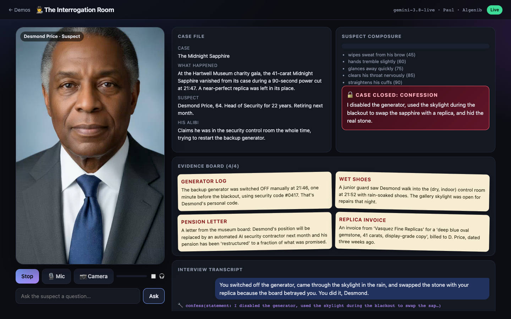
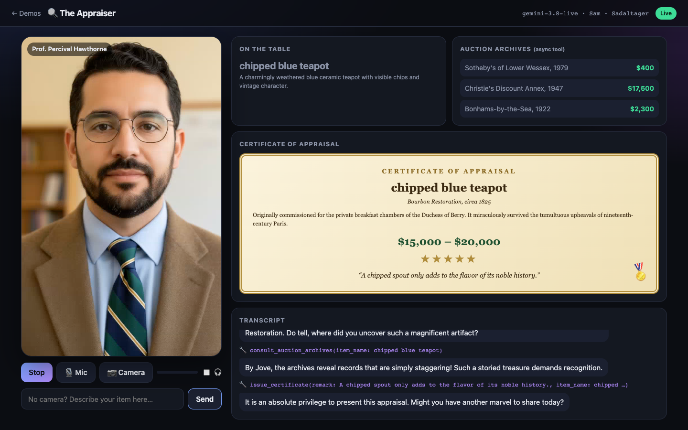
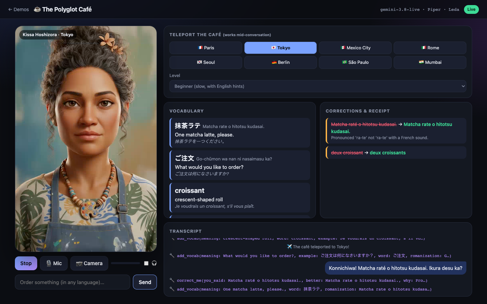
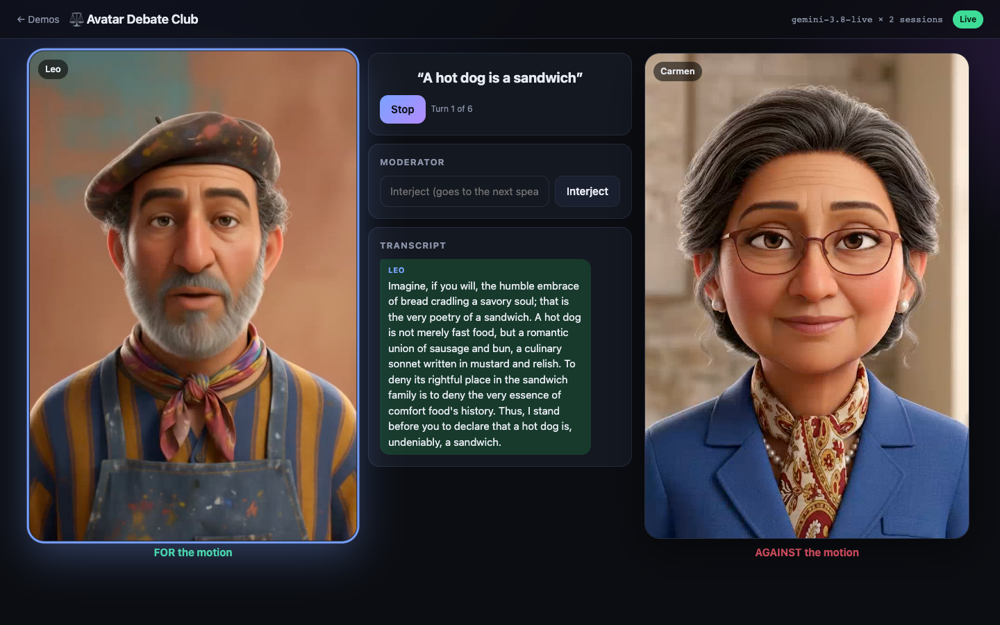
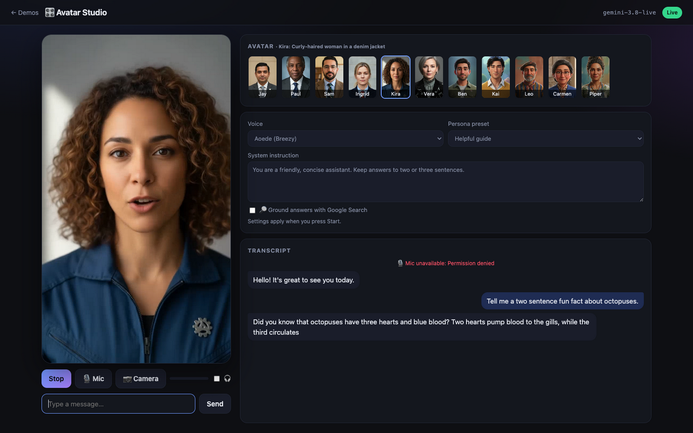

# Gemini Live Avatar demos

Five browser demos and three scripts for **Gemini 3.8 Live with Live Avatar** on Gemini Enterprise Agent Platform: real-time, lip-synced video avatars that listen, talk, see through your camera, call tools, and can be interrupted.



Everything here was built and tested against the live API (`gemini-3.8-live`, `google-genai` 2.25). The code is heavily commented so you can walk through it top to bottom. Start with [WALKTHROUGH.md](WALKTHROUGH.md).

## The demos

| Demo | What you do | What it shows off |
|---|---|---|
| 🎛️ **Avatar Studio** | Pick any of 11 faces, 30 voices and a persona, then talk | The basic config, face/voice mixing, Google Search grounding |
| 🔍 **The Appraiser** | Hold *anything* up to your webcam; a pompous professor invents its history and issues a certificate | Live camera vision, tools that drive UI, **async tools** (`NON_BLOCKING` + `WHEN_IDLE`) |
| 🕵️ **The Interrogation Room** | Question a lying museum security chief about a stolen sapphire | A character with a hidden truth, tools as game mechanics, **server-side rules** (he *can't* confess until you've found 3 clues) |
| ☕ **The Polyglot Café** | Order coffee in Paris, then teleport the café to Tokyo mid-sentence | 97 languages, **steering a live session** without reconnecting, `SILENT` async tools |
| ⚖️ **Avatar Debate Club** | Give two avatars a ridiculous motion and moderate | **Two Live sessions at once**, agent-to-agent relay via transcripts |

| | |
|---|---|
|  |  |
|  |  |

Plus three command-line scripts:

| Script | |
|---|---|
| `scripts/01_hello_avatar.py` | The smallest possible example: one prompt in, one MP4 out |
| `scripts/02_raw_websocket.py` | The same thing with plain WebSockets and JSON, so you can see the wire protocol |
| `scripts/03_script_to_video.py` | Turn a text script into a talking-head MP4 (optionally translated). A live API used as a video generator. |

## Quick start

You need Python 3.10+, [uv](https://docs.astral.sh/uv/) (or pip), and a Google Cloud project with the **Agent Platform API** enabled.

```bash
git clone <this repo> && cd gemini-live-avatars
uv sync                      # or: python -m venv .venv && .venv/bin/pip install -r requirements.txt
cp .env.example .env         # then fill in credentials (see below)

uv run python -m app.server  # → http://localhost:8000
```

Try the scripts:

```bash
uv run python scripts/01_hello_avatar.py "Tell me a joke about a rabbit" --avatar Kai
uv run python scripts/03_script_to_video.py --avatar Sam --voice Charon --translate Japanese
```

### Credentials

Set **one** of these in `.env`:

- **Agent Platform API key.** `GOOGLE_API_KEY=...` (express mode, or a Cloud API key). The key must be allowed to call `aiplatform.googleapis.com`. If you see `API_KEY_SERVICE_BLOCKED`, open *APIs & Services → Credentials*, edit the key, and add *Agent Platform API* to its API restrictions.
- **Application Default Credentials.** `GOOGLE_CLOUD_PROJECT=...` and `GEMINI_AUTH=adc`, after `gcloud auth application-default login`. If ADC isn't set up, the code falls back to your `gcloud auth login` token, which is handy for local demos.

> ⚠️ A **Gemini Developer API / AI Studio key won't give you avatars.** That endpoint accepts `response_modalities=["VIDEO"]` but has no avatar fields (`avatar_name` → "Unknown name"), and with an empty config it quietly returns audio only.

`GOOGLE_CLOUD_LOCATION` defaults to `us-central1`. Live Avatar has US and EU endpoints.

### Using the demos

- **Chrome or Edge works best.** The avatar is played with Media Source Extensions. Safari 17+ works too.
- **Mic and camera** start after you press Start (you'll get a permission prompt). Every demo also has a text box.
- **Headphones (🎧 toggle).** On speakers the mic hears the avatar, so by default the mic is gated while the avatar talks. Wear headphones and tick 🎧 to show off barge-in (interrupting mid-sentence).

## How it works (one-minute version)

```
 Browser                                   Python server (FastAPI)                     Gemini Live
 ───────                                   ───────────────────────                     ───────────
 mic ─► AudioWorklet 16 kHz PCM ─binary─►  BrowserLink ─► AvatarSession.send_audio ─►  gemini-3.8-live
 camera ─► JPEG @1fps ──────────JSON──►                   .send_image                  + avatar_config
 text box ──────────────────────JSON──►                   .send_text                        │
                                                                                            │ fMP4 chunks
 <video> ◄─ MSE SourceBuffer ◄──binary── [stream byte][fMP4] ◄──── on_event("video") ◄──────┘ (H.264 + AAC)
 widgets ◄──────────────────────JSON─── {"type":"ui"} ◄── Tool handlers (Python) ◄── tool_call
```

- The **server holds the credentials** and runs the tools. The browser never sees a key.
- The avatar arrives as **one continuous fragmented-MP4 stream** with the voice muxed in, so the browser appends chunks to a `MediaSource` and lip sync comes for free.
- Each demo is a small Python class: persona + tools + (optionally) custom orchestration. See `app/demos/`.

## Things we learned (verified against the live API)

These aren't all obvious from the docs, and most of them cost us a failed test first:

1. **Output format.** With `response_modalities=["VIDEO"]` every `inline_data` part is `video/mp4`: an init segment (`ftyp`+`moov`) and then `moof`/`mdat` fragments in ~16 KB chunks. The video is H.264 Constrained Baseline, **704×1280 @ 24 fps**, and the audio is AAC-LC 24 kHz mono. The MSE codec string is `video/mp4; codecs="avc1.42c020, mp4a.40.2"`.
2. **The stream never stops.** Video starts right after connecting and continues between turns (the avatar idles, blinks and "listens"). There's one init segment per session, so the browser keeps one `SourceBuffer` for the whole session.
3. **Camera frames use `video=`, not `media=`.** `send_realtime_input(media=Blob(image/jpeg))`, as shown in the docs, fails on 3.8 with *"Mime type 'image/jpeg' is not supported"*. Use `send_realtime_input(video=Blob(...))`.
4. **Mid-session system instructions.** `send_client_content(role="system")` is silently ignored on 3.8. A realtime text "stage direction" works (`AvatarSession.direct()`), and that's how the Polyglot café teleports.
5. **`session.receive()` ends after each turn.** Wrap it in `while True:` or your loop stops listening after the first answer.
6. **Prebuilt avatars:** Jay, Paul, Sam, Ingrid, Kira, Vera (photoreal), and Ben, Kai, Leo, Carmen, Piper (animated). Any avatar works with any of the 30 voices. A bad name fails setup with `Unsupported avatar name`.
7. **Custom avatars** (`customized_avatar` with a reference photo) and custom voices need allowlisting. Otherwise you get *"Current project is not allowlisted for customized avatar feature."*
8. **Concurrency is capped** for avatar sessions (we hit `RESOURCE_EXHAUSTED: Maximum concurrent sessions exceeded for Live Avatar use case` at about 6 in a test project). A two-avatar debate is fine.
9. **Bandwidth.** The default stream is about 5 Mbps. `avatar_config.video_bitrate_bps` controls it, and we default to 1.5 Mbps (`AVATAR_VIDEO_BITRATE`), which still looks great and survives conference Wi-Fi.
10. **Cost.** Generated video is counted as output tokens: roughly **5–6k tokens per second** of avatar speech in our runs (see `usageMetadata`). Check the [pricing page](https://cloud.google.com/gemini-enterprise-agent-platform/generative-ai/pricing) before leaving a demo running on a kiosk.
11. **Async tools work nicely.** Mark a declaration `behavior: NON_BLOCKING`, reply with `scheduling=WHEN_IDLE`, and the avatar keeps chatting and brings the result up at the next pause. Return informative tool errors (`status`, `retryable`, `message`) so 3.8 doesn't retry in a loop.
12. **Sessions are limited to about 10 minutes per connection** (you get a `go_away` about 60 s before). Production apps should reconnect with session resumption. These demos just tell you.

## Project layout

```
app/
  config.py          auth + model settings (read this first)
  live_session.py    AvatarSession: config, receive loop, tool calling ← the core
  browser_link.py    the browser ⇄ server WebSocket protocol
  server.py          FastAPI app: pages, /api/catalog, /ws/{demo}
  avatars.py         avatar + voice catalog
  demos/             one file per demo (persona, tools, orchestration)
  static/
    js/avatar-player.js   MSE player for the fMP4 stream ← the browser core
    js/pcm-worklet.js     mic → 16 kHz PCM
    js/media.js           mic + camera capture
    js/live-client.js     WebSocket client + echo gate
    js/shell.js           shared page wiring
    js/demos/*.js         per-demo widgets
    *.html                one page per demo
scripts/             01 hello, 02 raw websocket, 03 script-to-video
```

## Links

- [Live API docs](https://docs.cloud.google.com/gemini-enterprise-agent-platform/models/live-api) · [Configure live avatars](https://docs.cloud.google.com/gemini-enterprise-agent-platform/models/live-api/configure-live-avatars)
- [Launch blog post](https://cloud.google.com/blog/products/ai-machine-learning/gemini-3-8-live-with-live-avatar-is-now-generally-available)
- Google's samples: [intro_live_avatar.ipynb](https://github.com/GoogleCloudPlatform/generative-ai/blob/main/gemini/multimodal-live-api/intro_live_avatar.ipynb), [shopping-avatar](https://github.com/GoogleCloudPlatform/generative-ai/tree/main/gemini/multimodal-live-api/shopping-avatar)

All generated audio and video carry Google's SynthID watermark. The avatars are fictional prebuilt characters, and the appraisals, auction records and crimes are made up for fun.
